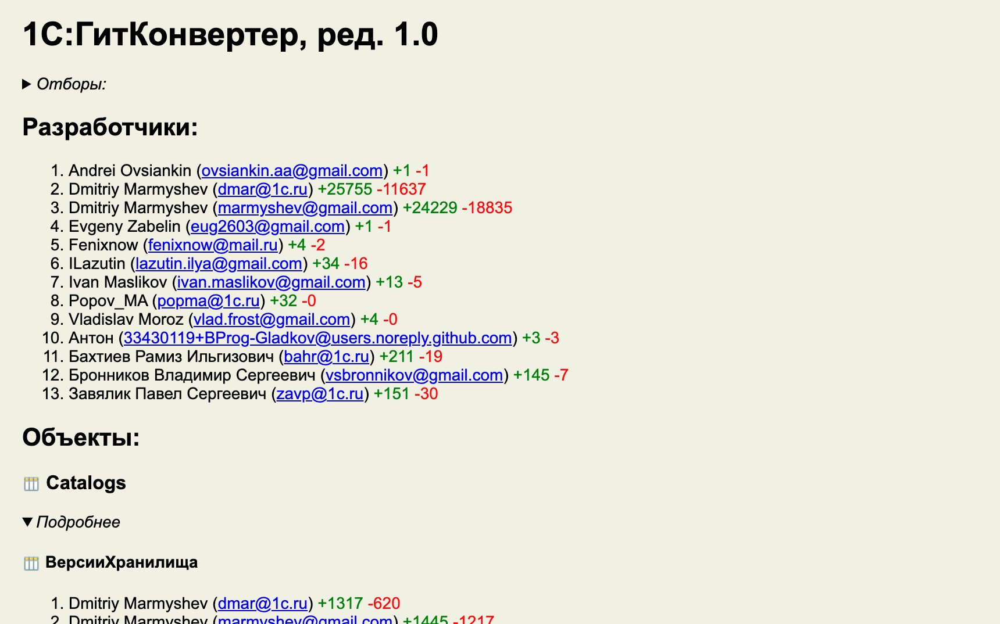

# Сбор статистики по количеству строк кода в 1С конфигурации


## Примеры выполнения

В результате выполнения скрипта будет получена вот такая статистика по репозиторию:



Ниже собрана статистика по публичным репозиториям фирмы 1С

1. Статистика по конфигурации [ДемоПриложение](https://github.com/1C-Company/dt-demo-configuration)

- MarkDown для просмотра в вебе [DemoApp1C.md](example/DemoApp1C.md)
- HTML для просмотра на своем месте [DemoApp1C.html](example/DemoApp1C.html)
- Excel для добавления отборов [DemoApp1C.xlsx](example/DemoApp1C.xlsx)

2. Статистика по конфигурации [ГитКонвертер](https://github.com/1C-Company/GitConverter)

- MarkDown для просмотра в вебе [GitConverter.md](example/GitConverter.md)
- HTML для просмотра на своем месте [GitConverter.html](example/GitConverter.html)
- Excel для добавления отборов [GitConverter.xlsx](example/GitConverter.xlsx)

## Как работать

- Внести свои данные в [src/settings.py](src/settings.py)
  - Путь до локального репо в ```path_to_repo()```
  - Относительный путь до src внутри репо в ```name_of_src()```
- Запустить на исполнение [src/main.py](src/codemeter.py)
- Результат выводится: 
  - markdown [result/stats.md](result/stats.md)
  - html [result/stats.html](result/stats.html)
  - excel [result/stats.xlsx](result/stats.xlsx)

## Как начать для новеньких

0. Устанавливаем python - [https://www.python.org](https://www.python.org/downloads/)
1. Клонируем репозиторий. В консоли пишем: ```git clone https://github.com/Oxotka/1Codemeter.git```
2. Переходим в папку 1Codemeter. В консоли пишем ```cd 1Codemeter``` 
3. Скачиваем зависимости. В консоли пишем: ```python -m pip install -r requirements.txt```

## Пример настройки и выполнения

TODO Подготовить видео с настройкой и запуском
